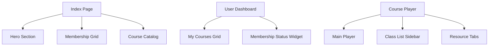

# Mapa de Navegación y Arquitectura de Información

## 1. Mapa del Sitio por Rol

### Estudiante (Cliente)
- **Home (Landing)**
  - Hero (Call to Action)
  - Precios de Membresía (Cards)
  - Vista previa de Catálogo
- **Dashboard Estudiante**
  - Cursos sugeridos
  - Mis Cursos (Inscritos)
  - Botón de Renovación
- **Viewer de Curso**
  - Reproductor Central
  - Sidebar con Índice de Clases
  - Tab de Recursos / Descargables
- **Configuración de Perfil**
  - Datos personales
  - Estado de cuenta (Suscripción)

### Profesor
- **Dashboard Profesor**
  - Resumen (Total Cursos, Alumnos Totales - Globales)
  - Botón "Crear Nuevo Curso"
- **Manager de Cursos**
  - Lista de cursos creados
  - Acceso a Edición / Eliminación
- **Editor de Contenido**
  - Formulario de metadatos (Título, Desc, Imagen)
  - Drag & Drop de Clases
  - Subida de material de apoyo

### Administrador
- **Overview Global**
  - KPI: Rendimiento mensual ($)
  - Usuarios Registrados
  - Actividad Reciente
- **Gestión de Usuarios**
  - Listado con filtros por rol
  - Botón para bloquear/activar usuarios
- **Auditoría de Pagos**
  - Historial de transacciones
  - Reporte de ingresos exportable
- **Moderación de Contenido**
  - Revisión de cursos subidos por profesores

## 2. Flujo de Activación de Membresía
1. **Registro**: Usuario crea cuenta.
2. **Selección**: Usuario elige Plan Mensual o Anual.
3. **Simulación de Pago**: Formulario de tarjeta (Frontend) -> Token -> Backend.
4. **Activación**: Backend crea `UserMembership` -> Redirección a Dashboard.
5. **Protección**: Middleware revisa estado `ACTIVE` en cada request a `/courses/`.

## 3. Jerarquía Visual (Frontend Components)

